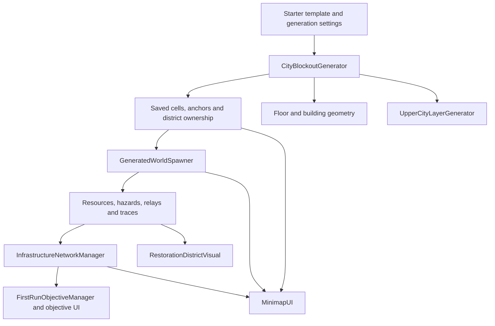

# Architecture and Source Tour

This guide describes the starter-area prototype published on the default branch. [Status](STATUS.md) distinguishes implemented systems from ongoing experiments. The project uses Unity MonoBehaviours, ordinary C# collections, serialized scene references, and direct method calls; it does not implement ECS, multiplayer networking, or a custom service framework.

## Shared Spatial Data

The generator's grid is the common coordinate system. `Vector2Int` cells represent locations; conversion methods map them to world positions. Saved lists record walkability, streets, alleys, plazas, starter-area coverage, semantic anchors, and district ownership. Hash-set lookup caches answer repeated membership queries, while several public getters return list copies.

This lets spawning and navigation consume the same layout decisions without guessing from building meshes. Saved records persist through Unity scene serialization; they are not a disk-save system for player progress.

Arrows represent data/control dependencies, not an event bus. Most of these relationships use direct calls or state queries.

## Generation and Population

Start with [CityBlockoutGenerator](../Assets/Scripts/CityBlockoutGenerator.cs), especially `GenerateCityBlockout`:

1. Clear previous generated content and cell records, choose a seed, and initialize grid storage.
2. Build the template-guided macro plan when enabled; establish workshop and relay-sector relationships.
3. Carve the street hierarchy, local detail, workshop accesses, and relay courtyards.
4. Connect disconnected walkable areas and assign restoration-district ownership.
5. Create floor/building geometry, rebuild lookup caches, invoke world population, and generate the upper-city layer.

`Random.InitState(seed)` seeds generation through Unity's global random state. A fixed seed is useful for reproducing layout issues under the same settings/code; it is not a guarantee that every runtime spawn or future version will be identical.

[GeneratedWorldSpawner](../Assets/Scripts/GeneratedWorldSpawner.cs) builds gameplay on that layout. `GenerateSpawnedObjects` clears previous spawned content, ensures a network manager, checks that city data exists, then places root supplies, infrastructure, district feedback, outbound supplies, relay caches, general resources, and hazards. Placement rules use classifications, anchors, distances, and occupancy/spacing checks. `ValidateOpeningPacing` checks aspects of relay placement; it does not prove solvability or economy balance.

The spawner can also populate an already-generated scene during `Start`. Scene references and lifecycle order therefore matter. Regeneration changes actual GameObjects and serialized data, rather than producing an immutable level asset.

## Relay Control Flow

[InfrastructureNetworkManager](../Assets/Scripts/InfrastructureNetworkManager.cs) records the Base Camp root state and registered nodes. `InfrastructureNode.Start` registers a node; destruction unregisters it. `GetNextRequiredNodeType` identifies the next missing Signal/Power/Transit stage, and `CanRestoreNode` checks restoration eligibility.

[RelayRestorationController](../Assets/Scripts/RelayRestorationController.cs) owns the player's local repair sequence: diagnostics, component-installation index, activation nodes, prompts, and state visuals. Completion calls `InfrastructureNode.CompleteRestoration`, which sets restored state and applies effects. The node notifies the network and calls map feedback; objectives and other components also query the resulting state.

`FirstRunObjectiveManager` turns root/relay milestones into objectives and the return-to-workshop memory milestone. `RestorationDistrictVisual` handles district feedback. Relay progression, repair interaction, and objective wording are separate components, but are still coupled through scene references and shared state.

## Survival, Inventory, and Interaction

[PlayerCondition](../Assets/Scripts/PlayerCondition.cs) tracks Core, Mobility, and Perception integrity. Passive decay and hazards damage systems; recharge and repair restore them. `PlayerMovement` queries a speed multiplier, `CameraFollow` responds to Perception, and Core failure switches UI state and exposes scene restart. Balance is determined by serialized values as well as code defaults.

[PlayerInventory](../Assets/Scripts/PlayerInventory.cs) stores counts in a dictionary keyed by `ItemType`. Crafting and repair callers check/spend `ItemCost` arrays. `OnInventoryChanged` notifies UI subscribers after mutations; recipes and item-use effects are defined separately. This is a simple shared inventory, not a transactional persistence service. Cost arrays and amounts rely on caller/data conventions; the API is not hardened against arbitrary invalid input.

`InteractionPromptUI` tracks prompt ownership, priority, and distance so nearby stations can compete for one prompt. `UIStateManager` controls gameplay input, cursor state, and pause/failure effects. Inventory and workbench interfaces use those states to avoid normal gameplay input while active.

`GameReferences.Awake` resolves serialized references and fallback lookups; several other components also perform lookups when needed. This simplifies iteration but leaves scene setup and initialization order as dependencies.

## Source Map

| Area | Related Components |
| --- | --- |
| City layout and overhead structure | `CityBlockoutGenerator`, `UpperCityLayerGenerator`, `LocalGridLandmarkSite` |
| Population and discoveries | `GeneratedWorldSpawner`, `ScrapPickup`, `RelaySalvageCache`, `HazardZone`, `EnvironmentalFragment` |
| Workshop | `BaseCampLayoutManager`, `BaseCampZone`, storage/terminal stations, `RechargeStation` |
| Navigation and feedback | `MinimapUI`, `ScanPulseEffect`, `RestorationDistrictVisual`, HUD and message components |
| Items and recipes | `PlayerInventory`, `ItemDatabase`, `CraftingRecipeDatabase`, `ItemUseSystem` |
| Iteration | `DevConsoleCommandSystem`, `DevConsoleUI`, `FailstateSceneTools` |

All project gameplay components currently live in [Assets/Scripts](../Assets/Scripts); tools live in [Assets/Editor](../Assets/Editor). These are responsibility groups, not separate assemblies or packages.

## Decisions and Tradeoffs

- **Templates plus generated detail:** preserve starter progression relationships while varying local navigation; validation remains necessary when changing dimensions, templates, or placement rules.
- **Serialized cell lists plus lookup caches:** retain layout data across scene saves and support membership queries; copies, invalidation, and regenerated geometry must remain consistent.
- **Generated objects saved in the scene:** make the blockout inspectable in the editor, at the cost of a large scene file and noisy regeneration diffs.
- **Direct calls plus state queries:** make the prototype easy to trace, but couple systems to scene setup and polling. Inventory change notifications are a specific event, not evidence that the whole project is event-driven.
- **Large generation/map components:** allow rapid integrated iteration; layout planning, construction, placement, and presentation are not yet cleanly separated. No broad refactor was performed for portfolio presentation.
- **Limited verification:** pacing checks and developer commands aid diagnosis. There is no project-specific automated gameplay regression suite, measured performance target, or disk persistence. See [Playtesting](PLAYTESTING.md).
